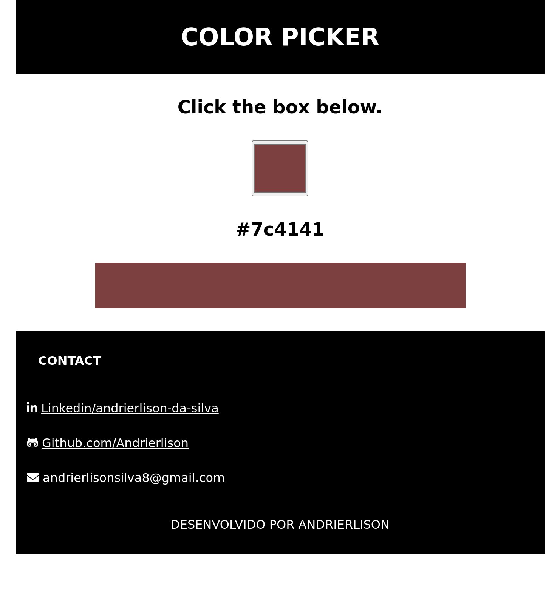

<h1 align="center">
    <a href="https://andrierlison.github.io/color-picker/">🔗Color Picker</a>
</h1>

<p align="center">A hexadecimal color picker</p>

<p align="center">
    <a href="#technologies">Technologies</a> •
    <a href="https://github.com/Andrierlison/color-picker/blob/master/LICENSE" target="_blank">License</a> •
    <a href="#author">Author</a>
</p>

<p align="center">
    
</p>

<div align="center">
<h1>Under development</h2>
<p>In the future I intend to implement other color formats, such as hsl and rgb.</p>
</div>

<h1 id="technologies">The following tools were used in the construction of the project:</h1>

- [Html](https://developer.mozilla.org/pt-BR/docs/Web/HTML)
- [Css](https://developer.mozilla.org/pt-BR/docs/Web/CSS)
- [Javascript](https://developer.mozilla.org/pt-BR/docs/Aprender/JavaScript)

<h1>Copy</h1>
<p>You can feel free to copy the page</p>

<p>Before you begin, you will need to have the following tools installed on your machine</p>
<a href="https://git-scm.com">Git</a>
<p>In addition, it is good to have an editor to work with the code as <a href="https://code.visualstudio.com/">VSCode</a></p>

<h1>Clone this repository</h1>

```
$ git clone https://github.com/Andrierlison/color-picker

# Access the project folder in the / cmd terminal

$ cd color-picker
```

<h1 id="author">Author</h1>

<p>Andrierlison da Silva</p>
<a href="https://www.linkedin.com/in/andrierlison-da-silva-916775190/">🔗Linkedin</a>
<a href="https://github.com/Andrierlison">🔗Github</a>
<a href="mailto:andrierlisonsilva8@gmail.com"><i class="fas fa-envelope"></i>🔗andrierlisonsilva8@gmail.com</a>
